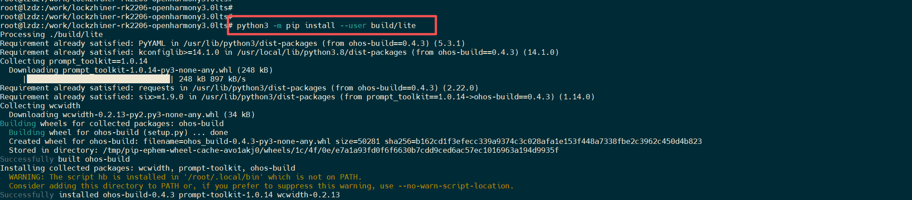
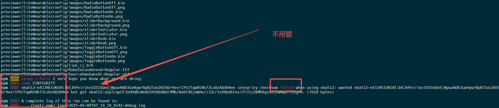
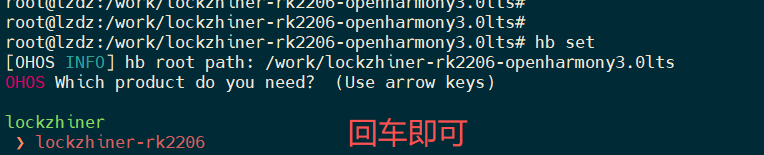
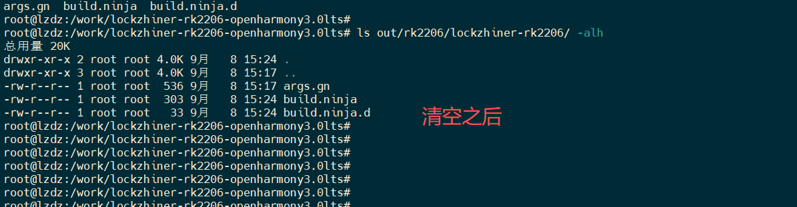
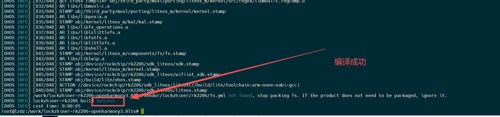
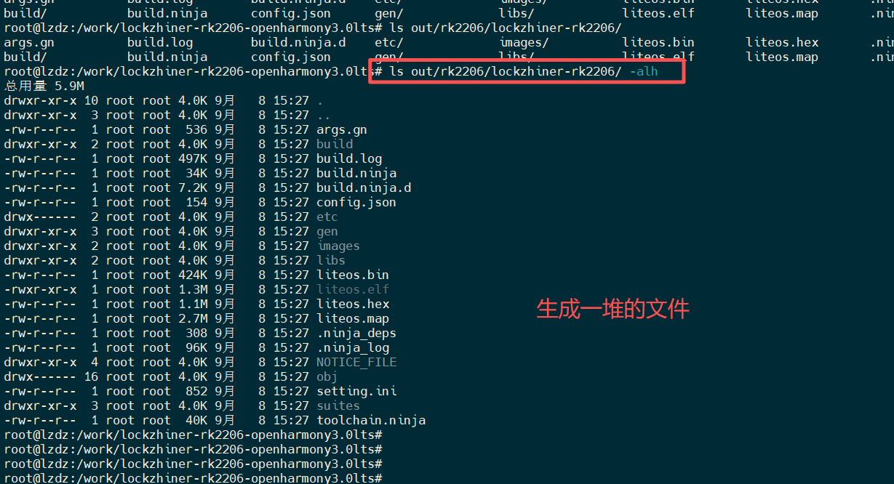

# 01-rk2206编译环境搭建

虚拟机等安装参考官方文档，编译参考一下内容

<https://gitee.com/Lockzhiner-Electronics/lockzhiner-rk2206-openharmony3.0lts/tree/master>

## 一、下载代码

1. **创建工作目录**

    ```shell
    cd /
    mkdir work
    ```

2. **下载代码.**

    切换到工作目录

    ```shell
    git clone https://gitee.com/Lockzhiner-Electronics/lockzhiner-rk2206-openharmony3.0lts.git
    ```

## 二、创建编译环境

1. **安装依赖**

    ```shell
    #!/bin/bash

    apt-get install -y python3-pip
    apt-get install -y gcc-arm-none-eabi
    apt-get install -y build-essential
    apt-get install -y gcc
    apt-get install -y g++
    apt-get install -y make
    apt-get install -y zlib*
    apt-get install -y libffi-dev
    apt-get install -y e2fsprogs
    apt-get install -y pkg-config
    apt-get install -y flex
    apt-get install -y bison
    apt-get install -y perl
    apt-get install -y bc
    apt-get install -y openssl
    apt-get install -y libssl-dev
    apt-get install -y libelf-dev
    apt-get install -y libc6-dev-amd64
    apt-get install -y binutils
    apt-get install -y binutils-dev
    apt-get install -y libdwarf-dev
    apt-get install -y u-boot-tools
    apt-get install -y mtd-utils
    apt-get install -y gcc-arm-linux-gnueabi
    apt-get install -y cpio
    apt-get install -y device-tree-compiler
    apt-get install -y curl
    apt-get install -y unzip
    pip3 install setuptools kconfiglib
    python3 -m pip install build
    ```

2. **安装hb工具**

    ```shell
    python3 -m pip install --user build/lite
    ```

    说明：**要在工程目录下执行，否则安装安装会失败，版本也会不对。**

    

3. **预编译**

    ```shell
    ./build/prebuilts_download.sh
    ```

    出现问题

    ```text
    previewer/liteWearable/config/images/sliderKnob.png
    previewer/liteWearable/config/images/ToggleButtonOff.bin
    previewer/liteWearable/config/images/ToggleButtonOff.png
    previewer/liteWearable/config/images/ToggleButtonOn.bin
    previewer/liteWearable/config/images/ToggleButtonOn.png
    previewer/liteWearable/config/line_cj.brk
    previewer/liteWearable/config/RobotoCondensed-Regular.ttf
    previewer/liteWearable/config/SourceHanSansSC-Regular.otf
    npm WARN using --force I sure hope you know what you are doing.
    npm ERR! code EINTEGRITY
    npm ERR! sha512-n43JRhlUKUAlibEJhPeir1ncUID16QnEjNpwzNdO3Lm4ywrBpBZ5oLD0I6br9evr1Y9JTqwRtAh7JLoOzAQdVA== integrity checksum failed when using sha512: wanted sha512-n43JRhlUKUAlibEJhPeir1ncUID16QnEjNpwzNdO3Lm4ywrBpBZ5oLD0I6br9evr1Y9JTqwRtAh7JLoOzAQdVA== but got sha512-xIp7/apCFJuUHdDLWe8O1HIkb0kQrOMb/0u6FXQjemHn/ii5LrIzU6bdECnsiTF/GjZkMEKg1xdiZwNqDYlZ6g==. (7610 bytes)

    npm ERR! A complete log of this run can be found in:
    npm ERR!     /root/.npm/_logs/2025-09-08T07_19_10_014Z-debug.log

    ```

    

4. **设置环境变量**

    ```shell
    source build/envsetup.sh
    ```

5. **hb设置**

    ```shell
    hb set -root
    hb set
    ```

    

## 三、编译

1. **清除旧文件**

    ```shell
    hb clean
    ```

    说明：清除`out`文件夹的相关编译文件

    

2. **编译**

    ```shell
    hb build -f
    ```

    

3. **查看编译bin文件**

    ```shell
    ls out/rk2206/lockzhiner-rk2206/ -alh
    ```

    
