# 01-鸿蒙ArkTS环境搭建

## 一、实验目的

1. 掌握华为开发者账号的注册与实名认证流程，理解账号在鸿蒙开发中的权限作用。
2. 成功下载并安装DevEco Studio 5.1.1.840开发工具，熟悉开发环境的基本配置项。
3. 学会正确安装鸿蒙应用开发所需的SDK，理解不同API版本的适配范围。
4. 掌握模拟器的安装与启动方法，能够配置适合的设备模拟环境。
5. 完成第一个鸿蒙ArkTS应用"Hello World"的创建、编译与运行，验证开发环境的可用性。
6. 理解鸿蒙应用开发的基本流程，为后续深入学习ArkTS编程奠定基础。

## 二、储备知识

1. **鸿蒙操作系统简介**：鸿蒙（HarmonyOS）是华为开发的分布式操作系统，支持多设备互联，采用分布式架构设计，具备低时延、高安全性等特点。ArkTS是鸿蒙应用开发的推荐语言，基于TypeScript扩展而来，提供了声明式UI、状态管理等特性。
2. **开发工具基础**：DevEco Studio是华为推出的鸿蒙应用开发集成环境（IDE），集成了代码编辑、编译、调试、模拟器等功能，简化了鸿蒙应用的开发流程。
3. **SDK概念**：软件开发工具包（SDK）包含了开发鸿蒙应用所需的API库、工具链、文档等资源，不同版本的SDK对应不同的鸿蒙系统版本特性。
4. **模拟器作用**：模拟器是在电脑上模拟鸿蒙设备运行环境的工具，可用于在没有真实设备的情况下调试应用程序。

## 三、任务分析

本次任务旨在搭建完整的鸿蒙ArkTS应用开发环境，核心流程包括账号准备、开发工具安装、SDK配置、模拟器部署以及验证环境可用性。通过注册华为账号获取开发权限，安装DevEco Studio作为开发载体，配置SDK提供开发所需的API支持，借助模拟器实现应用的运行测试，最终通过"Hello World"程序验证整个环境的正确性。整个过程需要注意版本兼容性（如DevEco Studio与SDK版本匹配）、网络连接（确保资源下载顺畅）以及系统权限（安装过程中可能需要的管理员权限）。

## 四、任务实施

### 步骤1 注册华为账号

1. 打开浏览器，访问华为开发者联盟官网 <https://developer.huawei.com/consumer/cn/>
2. 点击页面右上角"注册"按钮，选择个人账号注册（企业开发者可选择企业账号）。
    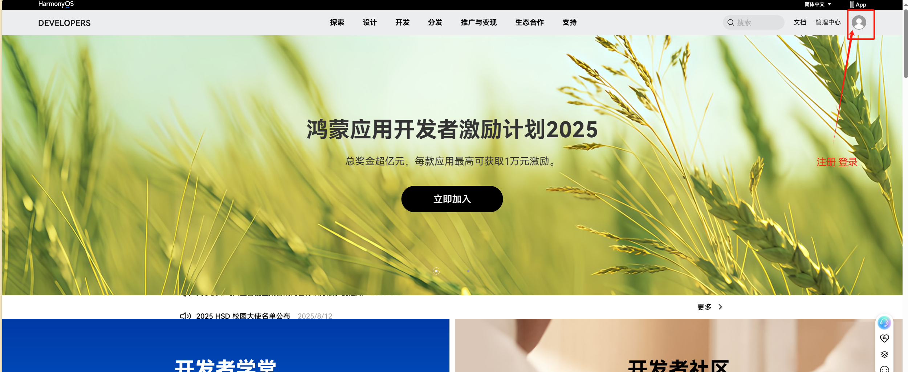
3. 按照提示输入手机号或邮箱，设置登录密码，完成短信或邮件验证。
4. 注册成功后，登录账号并完成实名认证（路径：账号中心-实名认证），上传身份证正反面照片并填写相关信息，提交审核（通常1-3个工作日完成）。
5. 实名认证通过后，进入开发者联盟控制台，确认账号已具备鸿蒙应用开发权限。

### 步骤2 下载DevEco Studio

1. 登录华为开发者联盟，进入"开发工具"页面<https://developer.huawei.com/consumer/cn/deveco-studio/>
2. 在DevEco Studio下载列表中，找到版本为5.1.1.840的安装包（根据操作系统选择Windows或macOS版本）。
3. 点击下载，同意用户协议后等待下载完成（建议使用下载工具提高速度，安装包大小约1-2GB）。
4. 下载完成后，校验安装包的MD5值（官网提供），确保文件未损坏。
    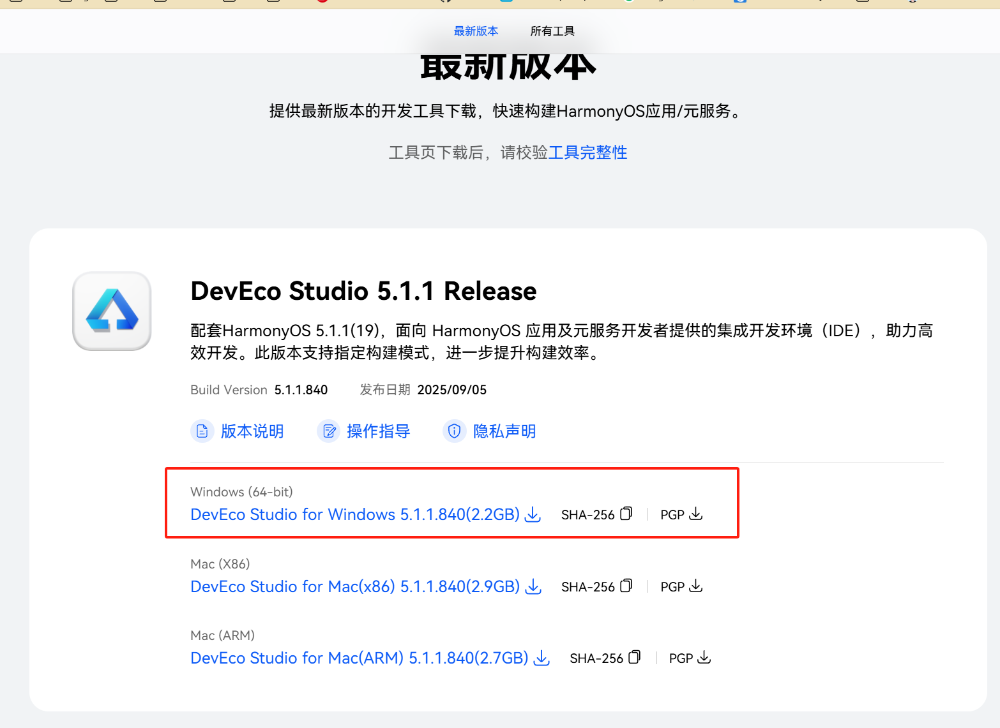

### 步骤3 安装IDE

1. 双击DevEco Studio安装包，启动安装程序，点击"Next"。
2. 阅读用户许可协议，勾选"我同意"，点击"Next"。
3. 选择安装路径（建议路径中不含中文和空格），点击"Next"。
4. 选择开始菜单文件夹，点击"Install"，等待安装完成。
5. 安装完成后，勾选"Run DevEco Studio"，点击"Finish"启动软件。
6. 首次启动时，会提示安装SDK，选择"Automatic"（自动安装），在弹出的SDK版本选择界面中，勾选与DevEco Studio 5.1.1.840兼容的API版本（如API 10或API 11），点击"OK"。
7. 等待SDK下载安装（过程需要联网，时间根据网络速度而定），完成后点击"Finish"。
    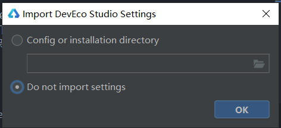

### 步骤4 创建 "Hello World"程序

1. 创建工程窗口
    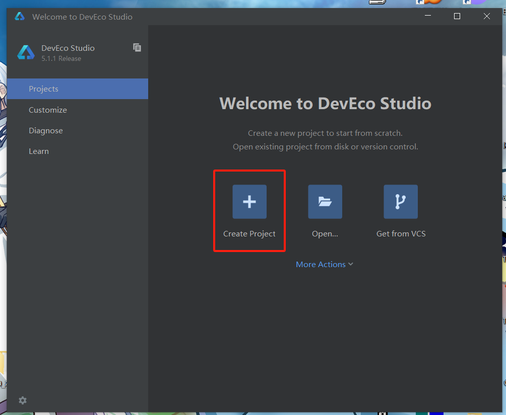
2. 选择模板
    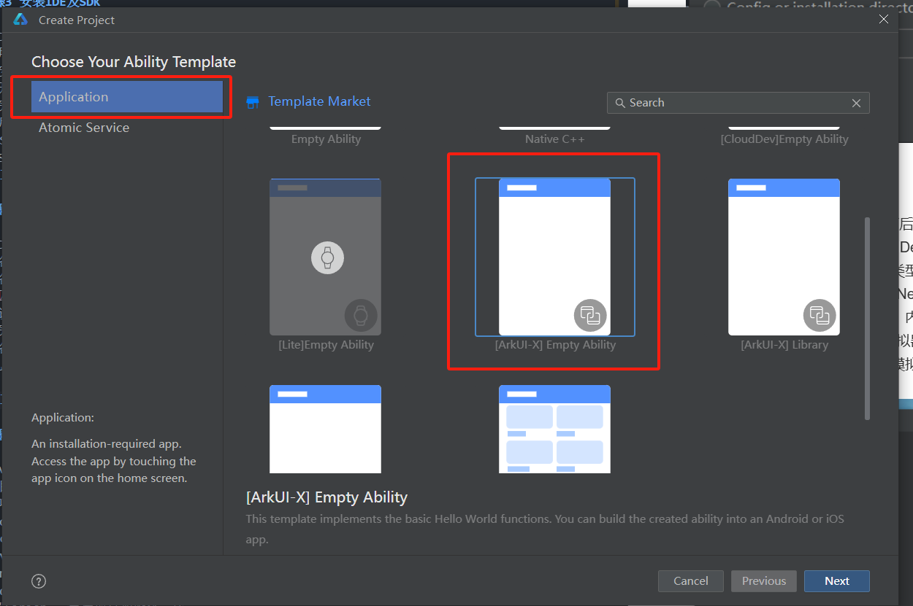
3. 配置项目名称
    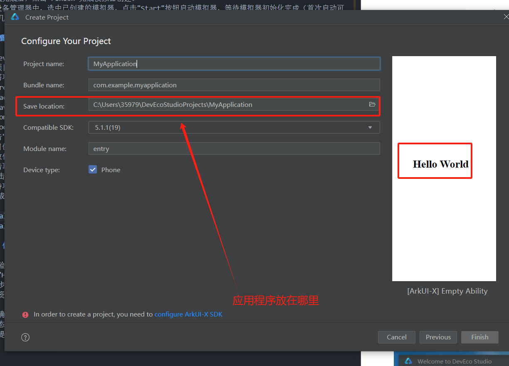
    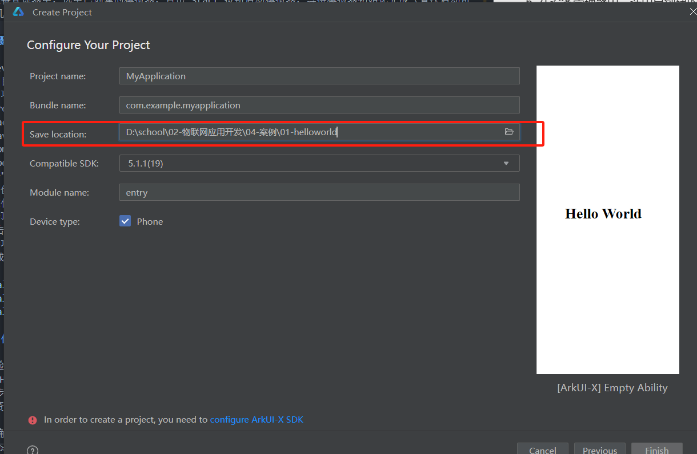
    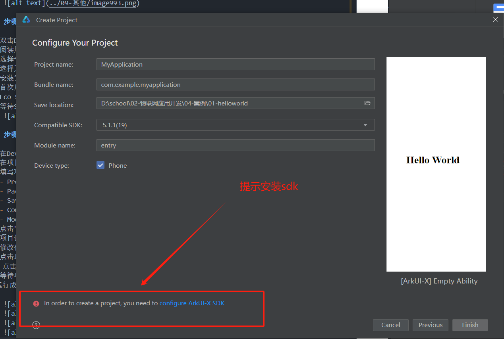
4. 下载SDK
   这个地方很坑爹，经常会登录不上，也不知道华为什么原因，官网经常出问题
   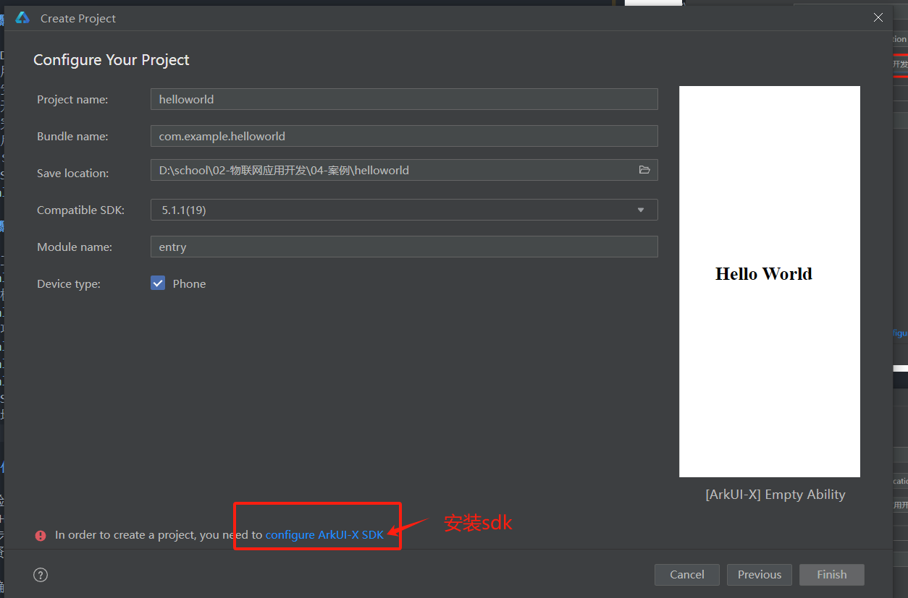
   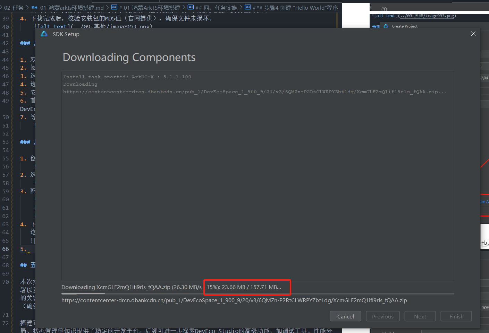

   **说明：**这个地方如果出现下载失败，如下面的log,要多试几次

   ```text
   Problem: Unable to obtain the license.

    Cause: Unable to obtain the license.
    Solution: Check the network and HTTP proxy settings, and then try again.

   ```

5. 进入工程目录
   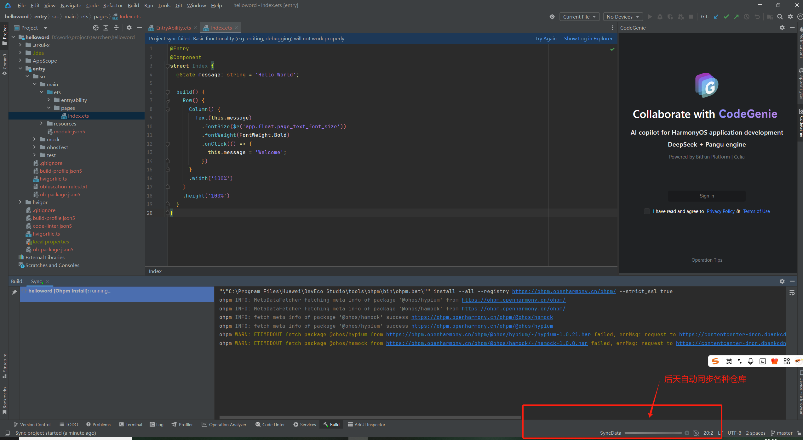

   也会同步失败，那就重新同步，以前安卓也是这样，估计是一个模子的东西
   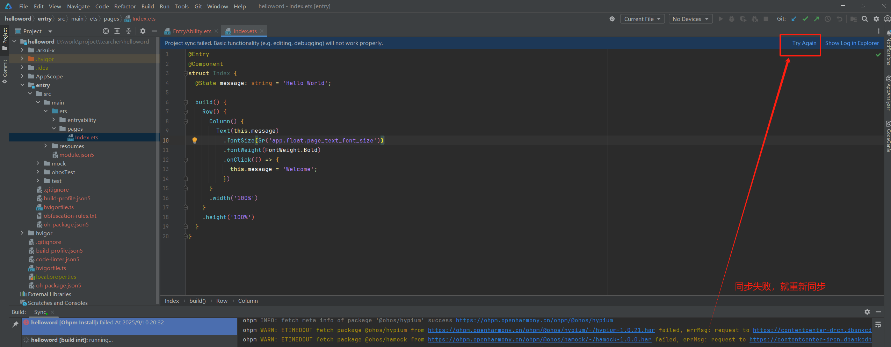

   **实在不行换个热点（换个运营商可能就好了，就是这么坑爹）**

6. 下载模拟器
   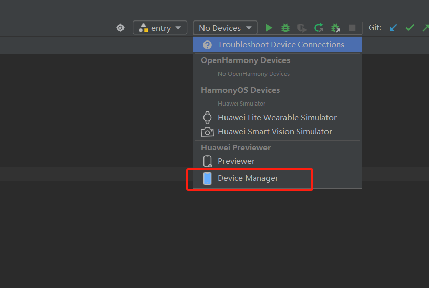

   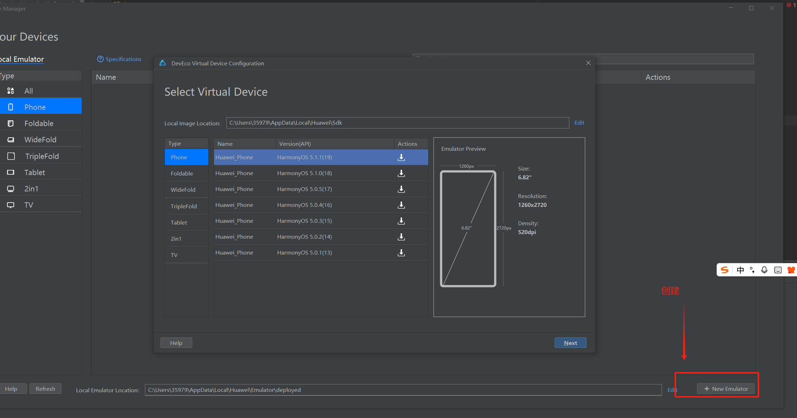

   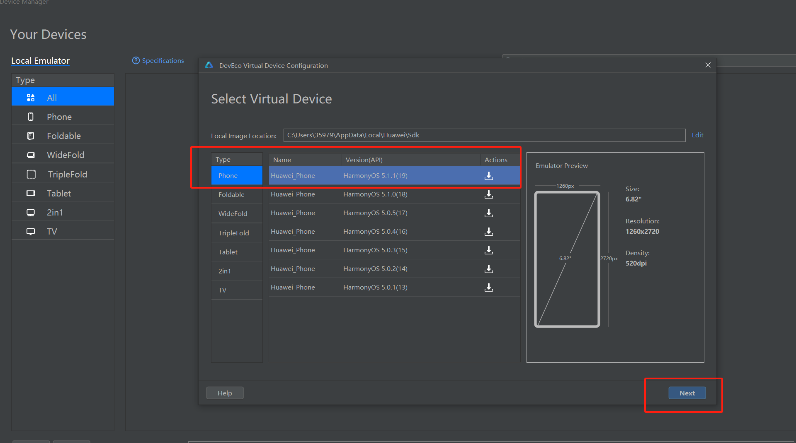

   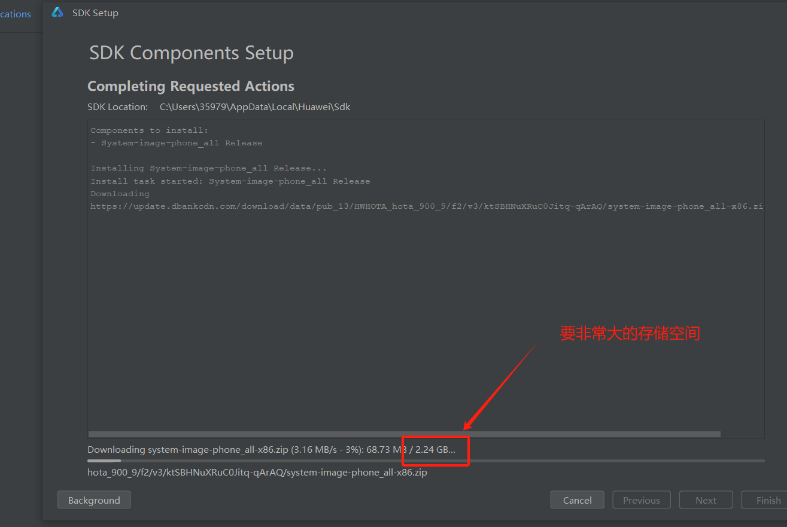

   **等吧，没招，如果是学生上课，很多人一起下载，不敢想要下载多久:sweat_smile:**

7. 打开模拟器
    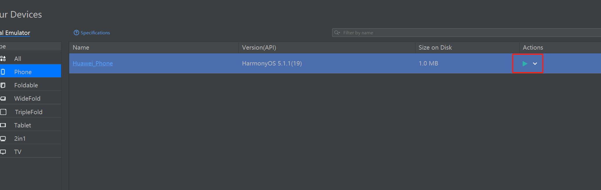

    **打开 Hyper-v**
    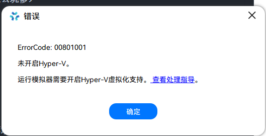

    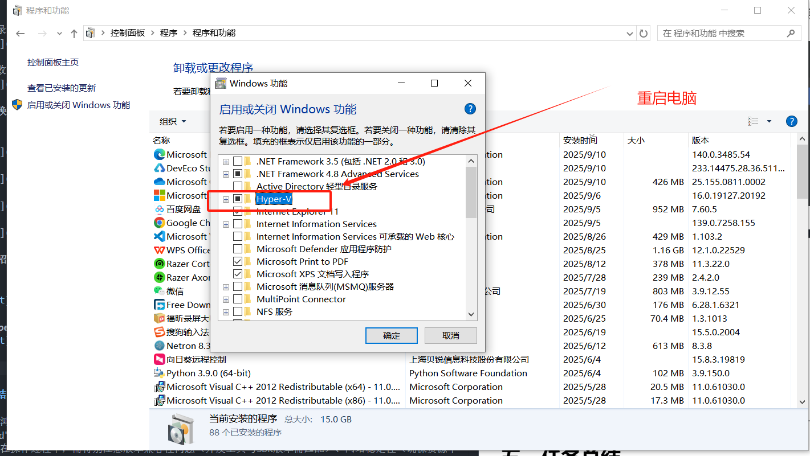

## 五、任务总结

本次实验完成了鸿蒙ArkTS开发环境的搭建，包括华为开发者账号注册、DevEco Studio安装、SDK配置、模拟器部署以及"Hello World"程序的运行。通过实验，理解了鸿蒙开发环境的构成及各组件的作用，掌握了开发环境搭建的关键步骤和注意事项。在操作过程中，需特别注意版本兼容性问题（开发工具与SDK版本需匹配）、网络稳定性（确保资源下载完整）以及实名认证的必要性（影响后续应用发布）。

搭建正确的开发环境是进行鸿蒙应用开发的基础，本次实验验证了环境的可用性，为后续学习ArkTS语法、UI布局、状态管理等知识提供了稳定的开发平台。后续可进一步探索DevEco Studio的高级功能，如调试工具、性能分析等，提升开发效率。

最重要是知道了官网经常会下载失败:gun:
